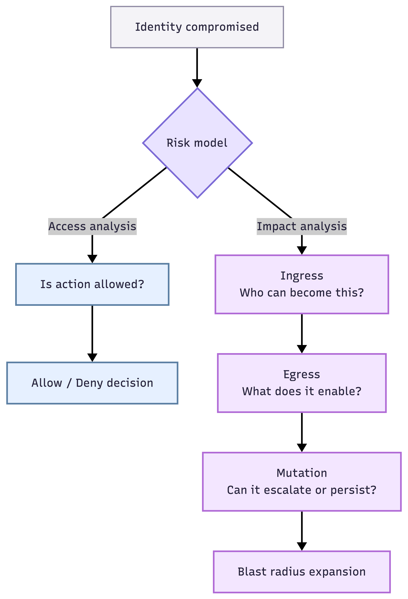

# iamwho
[](https://pypi.org/project/iamwho/)

> **Static AWS IAM analyzer focused on post-compromise blast radius.**


---

## How iamwho Thinks About Risk

The diagram below illustrates the difference between **access analysis** and **impact analysis**.

**Access analysis** asks whether an action is allowed.
**Impact analysis** asks what *else* becomes reachable once an identity is compromised.



*iamwho* walks this graph to expose escalation paths and blast-radius expansion
that are invisible when policies are evaluated in isolation.

---

## Why

Most AWS IAM tools answer a narrow, defensive question:

> *Is this action allowed?*

That question matters — but it’s incomplete.

**iamwho** is built around a different failure mode:

> *If this identity is compromised, what else becomes reachable?*

Attackers don’t think in terms of individual policies.
They think in **trust chains**, **permission composition**, and **what they can become next**.

| AWS Tool | Primary Focus | Blind Spot |
|:---------|:--------------|:-----------|
| IAM Access Analyzer | External access, unused permissions | Chained trust & role hopping |
| Policy Simulator | Point-in-time authorization | Post-compromise reach |
| Config Rules | Compliance posture | Effective permission composition |

IAM risk rarely lives in a single policy.

A role can appear low risk when reviewed in isolation, yet become dangerous when:
- it can be assumed by another reachable identity
- it grants permissions that enable mutation
- those permissions unlock additional roles or services

**iamwho** analyzes these relationships as a graph — surfacing **ingress → egress → mutation**
paths that expand blast radius even when no single policy looks suspicious.

---

## What iamwho Does

**iamwho** is a static **AWS IAM security analyzer** that models IAM the way an attacker would.

Static analysis here refers to **IAM configuration and trust relationships** —
not runtime activity, logs, or CloudTrail events.

It helps answer three core questions:

- **INGRESS** — Who can become this identity?
- **EGRESS** — What does this identity effectively enable?
- **MUTATION** — Can that access be escalated or persisted?

This tool is intentionally scoped for **security impact analysis**, not policy authoring,
education, or compliance reporting.

---

## Installation

```bash
pip install iamwho
```

---

## Quick Start

```bash
pip install iamwho && iamwho analyze arn:aws:iam::123456789012:role/MyRole
```

For development:

```bash
git clone https://github.com/YayoPalacios/iamwho.git
cd iamwho
pip install -e .
```

---

## Requirements

- Python 3.9+
- boto3
- rich
- typer

---

## Usage

```bash
# Run all checks
iamwho analyze arn:aws:iam::123456789012:role/MyRole

# Run a specific check
iamwho analyze <role-arn> --check egress
iamwho analyze <role-arn> -c ingress

# Verbose mode (reasoning and remediation hints)
iamwho analyze <role-arn> --verbose
iamwho analyze <role-arn> -v

# JSON output (CI/CD friendly)
iamwho analyze <role-arn> --json

# Fail if findings meet severity threshold (CI/CD gating)
iamwho analyze <role-arn> --fail-on high
iamwho analyze <role-arn> --fail-on critical

# Use a specific AWS profile
AWS_PROFILE=prod iamwho analyze <role-arn>
```


### Example Output

Running with `--verbose` provides reasoning and potential escalation paths:

```text
[HIGH] Role allows iam:PassRole to EC2
  └─ This enables creation of EC2 instances with elevated roles
     which may grant access to additional AWS services.

[CRITICAL] sts:AssumeRole chain detected
  └─ Compromised role can assume AdminRole via trust relationship
```

Using `--json` produces structured output suitable for CI/CD and reporting:

```json
{
  "role": "MyRole",
  "findings": [
    {
      "check": "mutation",
      "severity": "CRITICAL",
      "description": "Privilege escalation via sts:AssumeRole",
      "path": ["MyRole", "AdminRole"]
    }
  ]
}
```

---

## CI/CD Integration

**iamwho** can block pull requests that introduce risky IAM roles.

### GitHub Actions

Create `.github/workflows/iam-audit.yml`:

```yaml
- name: Analyze IAM Role
  run: |
    pip install iamwho
    iamwho analyze $ROLE_ARN --fail-on high
```

### Severity Gating

| Flag | Behavior |
|------|----------|
| `--fail-on critical` | Fails only on critical findings |
| `--fail-on high` | Fails on high or critical |
| `--fail-on medium` | Fails on medium and above |
| `--fail-on low` | Fails on any finding |

### Required Secrets

| Secret | Description |
|--------|-------------|
| `AWS_ACCESS_KEY_ID` | IAM user access key |
| `AWS_SECRET_ACCESS_KEY` | IAM user secret key |

> The IAM principal only requires `iam:GetRole` and `iam:GetRolePolicy`.

---

## Checks

| Check | Question It Answers |
|:------|:--------------------|
| ingress | Who can become this role? |
| egress | What does this role enable? |
| mutation | Can access escalate or persist? |

---

## Risk Levels

| Level | Meaning |
|:------|:--------|
| **CRITICAL** | Enables privilege escalation or long-lived persistence |
| **HIGH** | Expands blast radius across services or roles |
| **MEDIUM** | Enables discovery, staging, or limited lateral movement |
| **LOW** | Read-only or tightly scoped access with minimal composition risk |

---

## Roadmap

- [x] INGRESS analysis (trust policies)
- [x] EGRESS analysis (permissions)
- [x] MUTATION analysis (escalation paths)
- [x] JSON output for CI/CD
- [x] Exit codes for CI gating (`--fail-on`)
- [x] PyPI package release

### Planned

- User and group principal support
- Permission boundary analysis

---

## Contributing

iamwho is currently maintained as a personal security research project.

If you find issues, edge cases, or gaps in analysis, feel free to open an issue.
Suggestions and small pull requests are welcome as long as they fit the
security-focused scope of the project.

This tool is intentionally opinionated and not designed to cover all IAM use
cases.

---

## What iamwho Does Not Do

- Runtime detection or CloudTrail analysis
- Full IAM policy simulation
- Network or secrets analysis
- Compliance mapping (CIS, SOC2, etc.)

**iamwho** focuses strictly on **static IAM graph analysis** —
understanding what becomes reachable when an identity is abused.

---

## Documentation

- [Cheatsheet](docs/cheatsheet.md) — quick reference
- [Methodology](docs/methodology.md) — how iamwho reasons about IAM risk

---

## License

MIT
