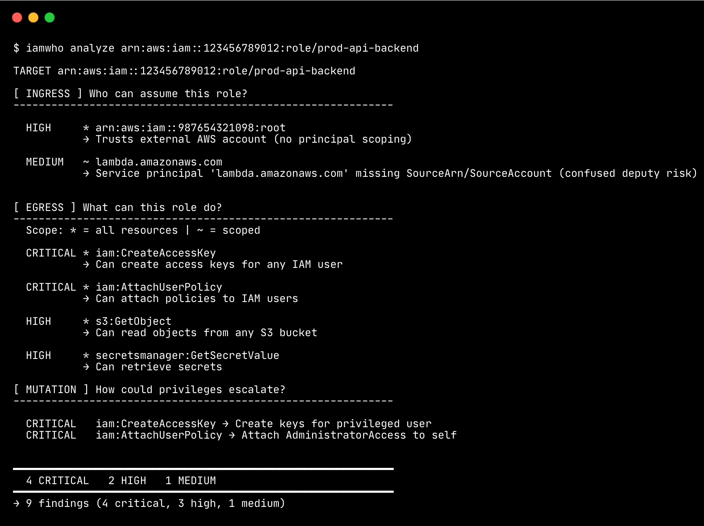

# iamwho
[](https://pypi.org/project/iamwho/)
> **Static IAM analyzer that shows what happens when one identity is compromised.**


---

## Why

Most AWS IAM tools answer a narrow question:

> *Is this action allowed?*

**iamwho** focuses on a different failure mode:

> *If this identity is compromised, what else becomes reachable?*

| AWS Tool | Focus | What It Misses |
|:---------|:------|:---------------|
| IAM Access Analyzer | External access, unused permissions | Chained attack paths |
| Policy Simulator | Point-in-time authorization | Post-compromise reach |
| Config Rules | Compliance posture | Permission composition |

**iamwho** exists to reason about **impact**, not just access.

Example: 

A role may appear low risk when viewed in isolation, but if its trust policy
allows assumption by another role that is reachable from a compromised user,
the effective blast radius expands significantly.

iamwho surfaces these ingress → egress → mutation chains even when no single
policy looks dangerous on its own.

---

## What iamwho does

**iamwho** is a static **AWS IAM security analyzer** built to look at IAM the way an attacker would.

Static analysis here refers to IAM configuration and trust relationships, not runtime activity or log data.

It helps answer three core questions:

- **INGRESS** - Who can assume this role?
- **EGRESS** - What permissions does the role effectively grant?
- **MUTATION** - Can those permissions be used to escalate or persist access?

This tool is intentionally scoped for **security analysis**, not IAM education or policy authoring.

---

## Installation

```bash
pip install iamwho
```

For development:

```bash
git clone https://github.com/YayoPalacios/iamwho.git
cd iamwho
pip install -e .
```

**Requirements**
- Python 3.9+
- boto3
- rich
- typer

---

## Usage

```bash
# Run all checks
iamwho analyze arn:aws:iam::123456789012:role/MyRole

# Run a specific check
iamwho analyze <role-arn> --check egress
iamwho analyze <role-arn> -c ingress

# Verbose mode (reasoning and remediation hints)
iamwho analyze <role-arn> --verbose
iamwho analyze <role-arn> -V

# JSON output (CI/CD friendly)
iamwho analyze <role-arn> --json

# Fail if findings meet severity threshold (CI/CD gating)
iamwho analyze <role-arn> --fail-on high
iamwho analyze <role-arn> --fail-on critical

# Use a specific AWS profile
AWS_PROFILE=prod iamwho analyze <role-arn>
```
---
## CI/CD Integration

IAMWho can block PRs that introduce risky IAM roles.

### GitHub Actions

Add `.github/workflows/iam-audit.yml`:

```
- name: Analyze IAM Role
  run: |
    pip install iamwho
    iamwho analyze $ROLE_ARN --fail-on high
```

| Flag | Behavior |
|------|----------|
| `--fail-on critical` | Fails only on critical findings |
| `--fail-on high` | Fails on high or critical |
| `--fail-on medium` | Fails on medium+ |
| `--fail-on low` | Fails on any finding |

### Required Secrets

| Secret | Description |
|--------|-------------|
| `AWS_ACCESS_KEY_ID` | IAM user access key |
| `AWS_SECRET_ACCESS_KEY` | IAM user secret key |

> The IAM user only needs `iam:GetRole` and `iam:GetRolePolicy` permissions.


---

## Checks

| Check | Question It Answers |
|:------|:--------------------|
| ingress | Who can become this role? |
| egress | What does this role enable? |
| mutation | Can access escalate or persist? |

---

## Risk levels

| Level | Meaning |
|:------|:--------|
| **CRITICAL** | Enables privilege escalation or long-lived persistence |
| **HIGH** | Expands blast radius across services or roles |
| **MEDIUM** | Enables discovery, staging, or limited lateral movement |
| **LOW** | Read-only or tightly scoped access with minimal composition risk |

---

## Example output



---

## Roadmap

- [x] INGRESS analysis (trust policies)
- [x] EGRESS analysis (permissions)
- [x] MUTATION analysis (escalation paths)
- [x] --json output for CI/CD
- [x] Exit codes for CI gating (--fail-on)
- [x] PyPI package release
- [ ] GitHub Actions example workflow

### Future
- User/group principal support
- Permission boundary analysis

---

## What iamwho does not do

- Runtime detection or CloudTrail analysis
- Full IAM policy simulation
- Network or secrets analysis
- Compliance mapping (CIS, SOC2, etc.)

**iamwho** focuses on **static IAM graph analysis** - understanding what becomes reachable when an identity is abused.

---
### Documentation 
- [Cheatsheet](docs/cheatsheet.md) — quick reference
- [Methodology](docs/methodology.md) — how iamwho thinks about IAM
---
## License

MIT
